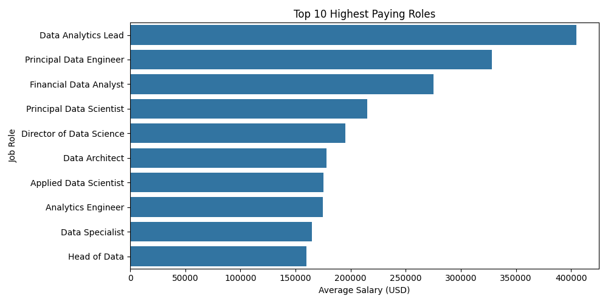
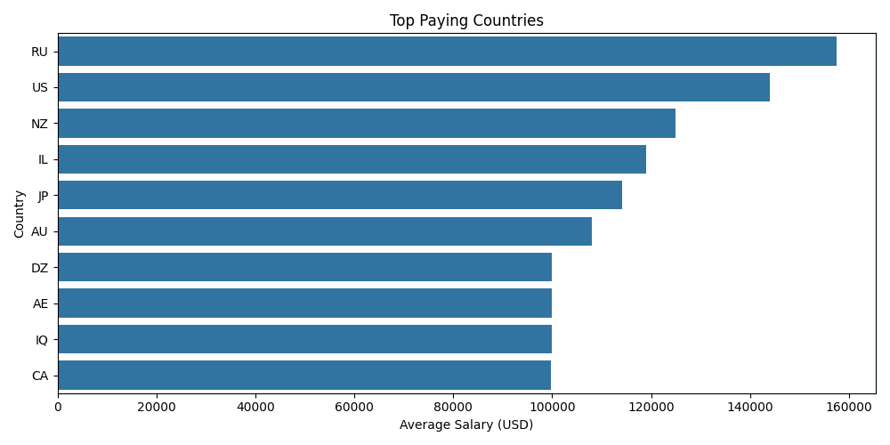

# IT Consulting Salary Analyser

Analyse global IT job salary data (600+ records from Kaggle) to surface trends by **job title**, **experience level**, and **company location**.

## Key Insights

| # | Finding |
|---|---------|
| 1 | **Data Analytics Lead** is the highest-paying role on average. |
| 2 | Senior-level professionals earn significantly more than Entry and Mid — the Mid → Senior jump is the steepest (~40 %). |
| 3 | The **United States** dominates salary levels, followed by Russia and New Zealand. |
| 4 | **Machine Learning** and **Data Engineering** roles show the strongest salary growth. |

## Dataset

- **Source:** [Kaggle – Data Science Job Salaries](https://www.kaggle.com/datasets/ruchi798/data-science-job-salaries)
- **Records:** 607
- **Key features:** `job_title`, `salary_in_usd`, `experience_level`, `company_location`, `employment_type`, `remote_ratio`

## Visualisations

### Top Paying Roles


### Salary by Experience Level


### Top Paying Countries


## How to Explore

The recommended way to read this project is the **Jupyter notebook** — it walks through every step like a story:

```
IT-Salary-Analyser/IT_Salary_Analyser.ipynb
```

Open it in **Jupyter**, **VS Code**, or **Google Colab** (File → Upload Notebook).

If you prefer the raw script:

```bash
cd IT-Salary-Analyser
pip install -r requirements.txt
python src/main.py
```

## Tech Stack

- Python · Pandas · Matplotlib · Seaborn
- Jupyter Notebook

## Domain Perspective

Having worked on IT consulting projects where I've seen hiring trends first-hand, these numbers match what I've observed in practice:

- **ML Engineer salaries are rising fastest.** In recent years, hiring briefs I've come across have consistently prioritised ML Engineer and Data Engineer roles over traditional developer positions — this dataset confirms that trend quantitatively.
- **The "Senior" jump is real.** Mid-level professionals often plateau until they can demonstrate ownership of end-to-end pipelines or models in production. The ~40 % salary gap between Mid and Senior levels in this data reflects that market reality.
- **US-centric salary data can be misleading globally.** While US averages dominate, cost-of-living adjustments and purchasing-power parity would paint a more nuanced picture for candidates in India, Eastern Europe, or Southeast Asia. A useful extension would be to normalise salaries by a PPP index.

## Next Steps

- Year-over-year trend analysis using the `work_year` column.
- Remote vs on-site salary comparison using `remote_ratio`.
- PPP-adjusted salary normalisation for global comparison.